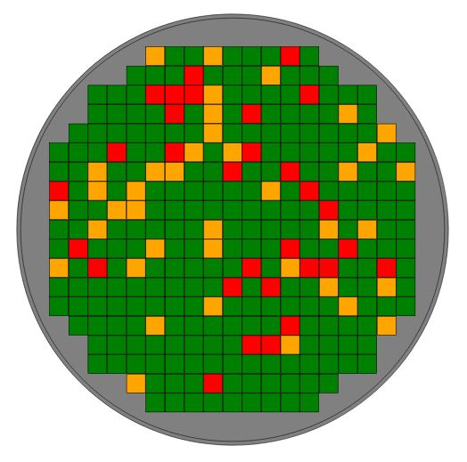

# react-d3-wafermap

React component that uses [D3.js](https://d3js.org/) to generate a very basic wafermap. The D3 code can be forked on Observable [here](https://observablehq.com/@sdfordham/simple-wafermap). The component follows the ''lifecycle methods wrapping'' structure due to [Nicolas Hery](https://nicolashery.com/integrating-d3js-visualizations-in-a-react-app/) via Marco Iglesias' great book [Pro D3.js](https://www.apress.com/gp/book/9781484252024). This repo was created with [create-react-app](https://github.com/facebook/create-react-app).
